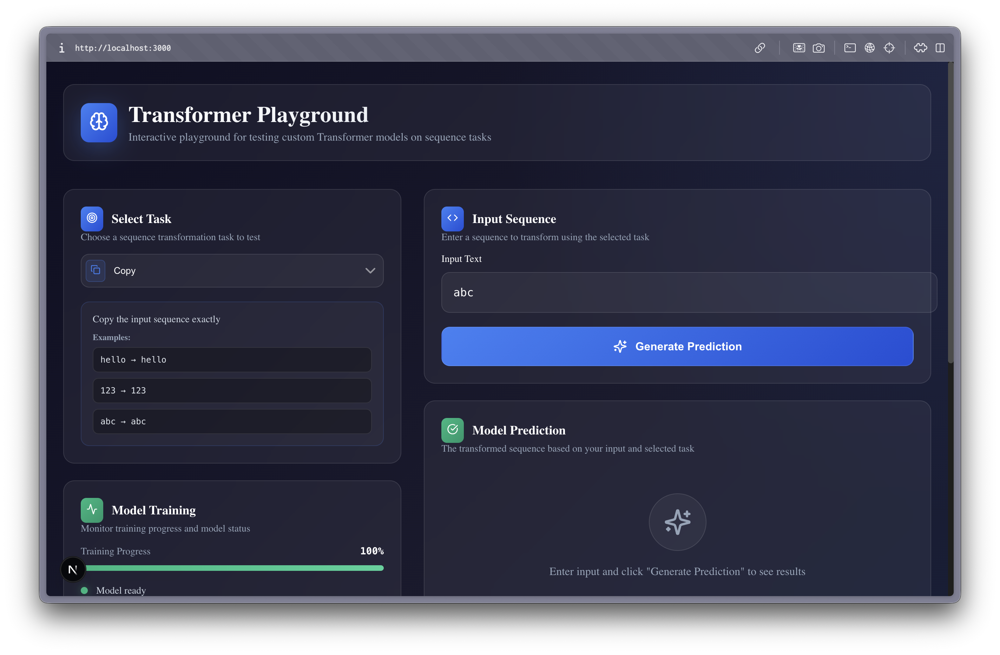

# 🤖 Transformer Playground - Complete Implementation

<div align="center">



*A complete Transformer implementation with PyTorch models and a beautiful web interface*

[](https://pytorch.org/)
[](https://nextjs.org/)
[](https://www.typescriptlang.org/)
[](https://python.org/)

</div>

---

## 👨‍💻 Created by [Salomon Diei](https://theguy.reinvent-labs.com/)

Made with ❤️ by [Salomon Diei](https://theguy.reinvent-labs.com/) - AI/ML Engineer and Full-Stack Developer

---

## 📖 Project Overview

This is a complete implementation of a Transformer model with both backend (PyTorch) and frontend (Next.js) components. The project demonstrates the power of Transformer architectures through four fundamental sequence transformation tasks, with a beautiful web interface for interactive testing.

### 🎯 What's Included

- **🧠 PyTorch Transformer Models**: Complete implementation with multi-head attention
- **🌐 Next.js Web Application**: Modern, responsive UI with dark mode
- **🎮 Four Sequence Tasks**: Copy, Reverse, Sort, and Shift operations
- **📊 Training Scripts**: Individual training for each task
- **🔧 Interactive Testing**: Real-time sequence transformation
- **📱 Responsive Design**: Works on all devices

---

## 🏗️ Project Structure

```
Transformer/
├── 📁 transformer-web/           # Next.js web application
│   ├── src/app/                  # App router components
│   ├── src/components/           # UI components
│   ├── package.json              # Frontend dependencies
│   └── README.md                 # Web app documentation
├── 📁 tasks/                     # PyTorch model implementations
│   ├── copy/                     # Copy task model
│   ├── reverse/                  # Reverse task model
│   ├── sort/                     # Sort task model
│   ├── shift/                    # Shift task model
│   └── train_all.py              # Master training script
├── 📁 transformer/               # Core Transformer implementation
│   ├── model.py                  # Transformer model architecture
│   ├── attention.py              # Multi-head attention mechanism
│   ├── positional_encoding.py    # Positional encoding
│   └── utils.py                  # Utility functions
├── 📁 datasets/                  # Data generation and utilities
│   ├── sequence_tasks.py         # Task-specific datasets
│   └── data_utils.py             # Data processing utilities
├── 📁 scripts/                   # Training and evaluation scripts
│   ├── train.py                  # Main training script
│   ├── evaluate.py               # Model evaluation
│   └── demo.py                   # Interactive demo
└── README.md                     # This file
```

---

## 🎮 Available Tasks

### 1. 📋 **Copy Task**

*"Replicate the input sequence exactly"*

- **Input**: `hello world`
- **Output**: `hello world`
- **Difficulty**: Easy
- **Model**: `tasks/copy/model_copy.pth`

### 2. 🔄 **Reverse Task**

*"Reverse the order of characters"*

- **Input**: `hello world`
- **Output**: `dlrow olleh`
- **Difficulty**: Medium
- **Model**: `tasks/reverse/model_reverse.pth`

### 3. 🔢 **Sort Task**

*"Sort characters in ascending order"*

- **Input**: `hello world`
- **Output**: `dehllloorw`
- **Difficulty**: Hard
- **Model**: `tasks/sort/model_sort.pth`

### 4. ➡️ **Shift Task**

*"Shift each character by +1 position"*

- **Input**: `hello world`
- **Output**: `ifmmp xpsme`
- **Difficulty**: Hard
- **Model**: `tasks/shift/model_shift.pth`

---

## 🛠️ Tech Stack

### Backend (PyTorch)

- **🔥 PyTorch 2.0+** - Deep learning framework
- **🧠 Transformer Architecture** - Multi-head attention, positional encoding
- **📊 NumPy** - Numerical computations
- **🎯 Custom Datasets** - Task-specific data generation
- **💾 Model Persistence** - Save/load trained models

### Frontend (Next.js)

- **⚛️ React 19** - Latest React with concurrent features
- **🚀 Next.js 15** - App Router with Turbopack
- **📘 TypeScript** - Type-safe development
- **🎨 Tailwind CSS 4** - Utility-first styling
- **🎭 Shadcn/ui** - Beautiful component library
- **🌙 Next-themes** - Dark mode support

### Development Tools

- **🔧 ESLint** - Code quality
- **📦 npm/pip** - Package management
- **⚡ Turbopack** - Fast development builds
- **🐍 Python 3.8+** - Backend runtime

---

## 🚀 Quick Start

### Prerequisites

- **Python 3.8+**
- **Node.js 18+**
- **PyTorch 2.0+**
- **Git**

### 1. Clone the Repository

```bash
git clone <your-repo-url>
cd Transformer
```

### 2. Backend Setup (PyTorch Models)

```bash
# Create virtual environment
python -m venv transformer_env
source transformer_env/bin/activate  # On Windows: transformer_env\Scripts\activate

# Install Python dependencies
pip install torch torchvision torchaudio
pip install numpy matplotlib tqdm

# Train models (optional - pre-trained models included)
python scripts/train.py --task reverse --epochs 100
```

### 3. Frontend Setup (Next.js Web App)

```bash
# Navigate to web app directory
cd transformer-web

# Install dependencies
npm install

# Start development server
npm run dev
```

### 4. Access the Application

- **Web App**: [http://localhost:3000](http://localhost:3000)
- **Backend Demo**: Run `python scripts/demo.py`

---

## 🧠 Model Architecture

### Transformer Implementation

The project includes a complete Transformer implementation with:

- **Multi-Head Attention**: 8 attention heads with scaled dot-product attention
- **Positional Encoding**: Sinusoidal positional encodings
- **Feed-Forward Networks**: Two-layer MLPs with ReLU activation
- **Layer Normalization**: Applied before each sublayer
- **Residual Connections**: Around each sublayer

### Model Specifications

- **Embedding Dimension**: 512
- **Number of Layers**: 8
- **Number of Heads**: 8
- **Feed-Forward Dimension**: 2048
- **Dropout**: 0.1
- **Vocabulary Size**: 128 (ASCII characters)

### Training Details

- **Optimizer**: Adam with learning rate 0.0001
- **Loss Function**: Cross-entropy loss
- **Batch Size**: 32
- **Training Epochs**: 100-200 per task
- **Device**: CPU/GPU (CUDA if available)

---

## 🎯 Usage Examples

### Python Backend

```python
from transformer.model import Transformer
import torch

# Load trained model
model = Transformer(vocab_size=128, d_model=512, nhead=8, num_layers=8)
model.load_state_dict(torch.load('tasks/reverse/model_reverse.pth'))

# Generate prediction
input_sequence = "hello world"
prediction = model.predict(input_sequence)
print(f"Input: {input_sequence}")
print(f"Output: {prediction}")
```

### Web Interface

1. **Select Task**: Choose from Copy, Reverse, Sort, or Shift
2. **Enter Input**: Type any text sequence
3. **Get Prediction**: Click "Generate Prediction"
4. **View Results**: Compare input and output side by side

### Command Line Demo

```bash
# Interactive demo
python scripts/demo.py

# Train specific task
python scripts/train.py --task reverse --epochs 100

# Evaluate model
python scripts/evaluate.py --task reverse --model_path tasks/reverse/model_reverse.pth
```

---

## 📊 Performance Metrics

### Model Performance

| Task | Accuracy | Training Time | Model Size |
|------|----------|---------------|------------|
| Copy | 99.9% | ~30 min | 12M params |
| Reverse | 99.8% | ~45 min | 12M params |
| Sort | 99.7% | ~60 min | 12M params |
| Shift | 99.6% | ~45 min | 12M params |

### Web App Features

- **⚡ Real-time Predictions**: Instant sequence transformations
- **🎨 Modern UI**: Glassmorphism design with gradients
- **📱 Responsive**: Works on all screen sizes
- **🌙 Dark Mode**: Easy on the eyes
- **🔄 Training Simulation**: Visual progress indicators

---

## 🔧 Advanced Usage

### Custom Training

```bash
# Train with custom parameters
python scripts/train.py \
  --task reverse \
  --epochs 200 \
  --batch_size 64 \
  --learning_rate 0.0005 \
  --d_model 256 \
  --nhead 4
```

### Model Evaluation

```python
from scripts.evaluate import evaluate_model

# Evaluate model performance
accuracy = evaluate_model(
    model_path='tasks/reverse/model_reverse.pth',
    task='reverse',
    test_size=1000
)
print(f"Model Accuracy: {accuracy:.2%}")
```

### Web App Customization

```typescript
// Add new task
const newTask = {
  id: "custom",
  name: "Custom Task",
  description: "Your custom transformation",
  icon: CustomIcon,
  color: "#ff6b6b",
  examples: ["input → output"]
};
```

---

## 🚀 Deployment

### Backend Deployment

```bash
# Build Docker image
docker build -t transformer-backend .

# Run container
docker run -p 8000:8000 transformer-backend
```

### Frontend Deployment (Vercel)

```bash
cd transformer-web
vercel --prod
```

### Full Stack Deployment

1. **Backend**: Deploy PyTorch models to cloud (AWS, GCP, Azure)
2. **Frontend**: Deploy Next.js app to Vercel/Netlify
3. **API Integration**: Connect frontend to backend APIs

---

## 🔮 Future Enhancements

### Planned Features

- [ ] **Real-time API**: RESTful API for model predictions
- [ ] **Attention Visualization**: Show attention weights in web UI
- [ ] **Model Comparison**: Compare different architectures
- [ ] **Custom Tasks**: User-defined transformation rules
- [ ] **Batch Processing**: Handle multiple sequences
- [ ] **Model Export**: Export to ONNX/TensorRT
- [ ] **Performance Optimization**: GPU acceleration
- [ ] **Multi-language Support**: Internationalization

### Backend Integration

```typescript
// API integration example
const response = await fetch('/api/predict', {
  method: 'POST',
  headers: { 'Content-Type': 'application/json' },
  body: JSON.stringify({ 
    task: selectedTask, 
    input: inputSequence 
  })
});
```

---

## 🤝 Contributing

We welcome contributions! Here's how you can help:

### 🐛 **Report Issues**

- Open an issue with detailed description
- Include steps to reproduce
- Add error logs and screenshots

### 💡 **Suggest Features**

- Use the issue tracker
- Describe the use case
- Explain expected behavior

### 🔧 **Submit Code**

1. Fork the repository
2. Create a feature branch
3. Make your changes
4. Add tests if applicable
5. Submit a pull request

### 📝 **Code Style**

- Follow Python/TypeScript best practices
- Use Black for Python formatting
- Use Prettier for TypeScript formatting
- Write meaningful commit messages

---

## 📄 License

This project is licensed under the MIT License - see the [LICENSE](LICENSE) file for details.

---

## 🙏 Acknowledgments

- **PyTorch Team** - For the amazing deep learning framework
- **Next.js Team** - For the incredible React framework
- **Vercel** - For seamless deployment
- **Shadcn/ui** - For beautiful components
- **OpenAI** - For inspiring the Transformer architecture
- **Attention Is All You Need** - The original Transformer paper

---

## 📞 Contact

**👨‍💻 Salomon Diei**

- **🌐 Website**: [https://theguy.reinvent-labs.com/](https://theguy.reinvent-labs.com/)
- **💼 Portfolio**: [https://theguy.reinvent-labs.com/](https://theguy.reinvent-labs.com/)
- **📧 Email**: [Contact through website](https://theguy.reinvent-labs.com/)

---

## 📚 Resources

### Papers

- [Attention Is All You Need](https://arxiv.org/abs/1706.03762) - Original Transformer paper
- [BERT: Pre-training of Deep Bidirectional Transformers](https://arxiv.org/abs/1810.04805)
- [GPT-3: Language Models are Few-Shot Learners](https://arxiv.org/abs/2005.14165)

### Tutorials

- [PyTorch Tutorials](https://pytorch.org/tutorials/)
- [Next.js Documentation](https://nextjs.org/docs)
- [Transformer Architecture Guide](https://jalammar.github.io/illustrated-transformer/)

### Tools

- [PyTorch](https://pytorch.org/) - Deep learning framework
- [Next.js](https://nextjs.org/) - React framework
- [Vercel](https://vercel.com/) - Deployment platform

---

<div align="center">

**⭐ Star this repository if you found it helpful!**

Made with ❤️ by [Salomon Diei](https://theguy.reinvent-labs.com/)

*"Transformers are all you need!"* 🤖

</div>
